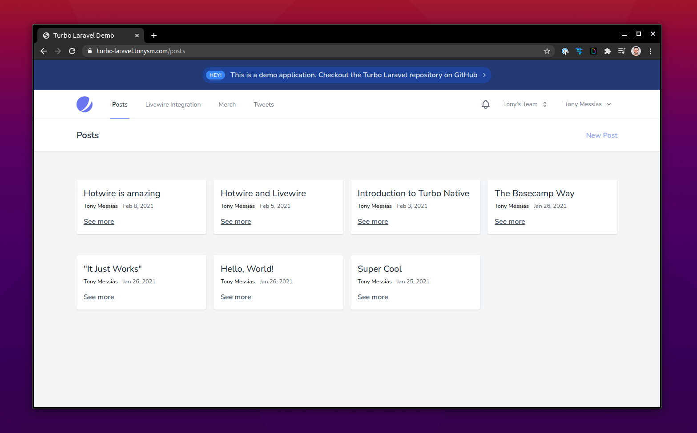

# Turbo Laravel Demo App

This application serves as an example of applying Hotwire in Laravel.



It uses:

- Turbo Laravel (via [`tonysm/turbo-laravel`](https://github.com/tonysm/turbo-laravel) package)
- Laravel WebSockets (via [`beyondcode/laravel-websockets`](https://github.com/beyondcode/laravel-websockets) package)
- Many built-in components from Laravel

This app is live. You can test it out at [turbo-laravel.tonysm.com](https://turbo-laravel.tonysm.com).

## Setup

The local environment relies on Laravel Sail. So, in order to continue, make sure you [check out the docs](https://laravel.com/docs/8.x/sail) from that.

**Install Composer dependencies**:

```bash
docker run --rm \
    -v $(pwd):/opt \
    -w /opt \
    laravelsail/php80-composer:latest \
    composer install
```

**Copy the `.env.example` file**:

```bash
cp .env.example .env
```
Then you can edit this new `.env` file as you want.
Of course you can also add your own file `.env` file.

**Generate the APP_KEY**:

```bash
docker run --rm \
    -v $(pwd):/opt \
    -w /opt \
    laravelsail/php80-composer:latest \
    php artisan key:generate
```

**Boot the Services Up**:

```bash
sail up -d
```

**Migrate the Database**:

```bash
sail artisan migrate
```

**Link the Storage Folder (for Importmap)**:

```bash
sail artisan storage:link
```

**Download Tailwind CSS and Compile**:

```bash
sail artisan tailwindcss:download
sail artisan tailwindcss:build
```

**Running a Worker**:

You will need a queue worker to process Turbo Stream broadcasts in background:

```bash
sail artisan queue:work --tries=1
```

### Legal Notices

For the Reactions feature, we're using [Twemoji](https://twemoji.twitter.com/) and giving attribution here. This is the [emoji dataset](https://github.com/iamcal/emoji-data) I'm using in combination with that service.
